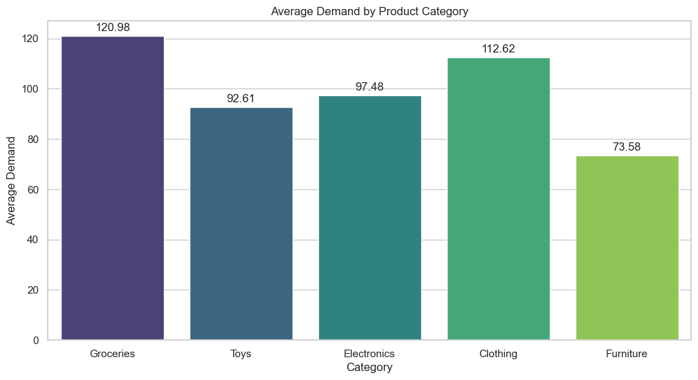
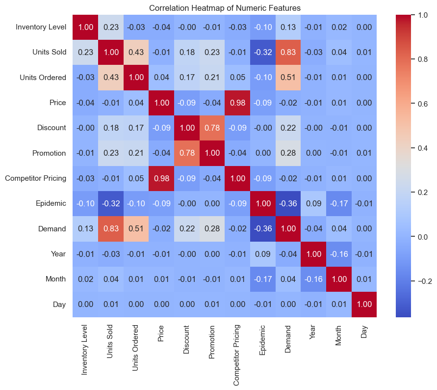
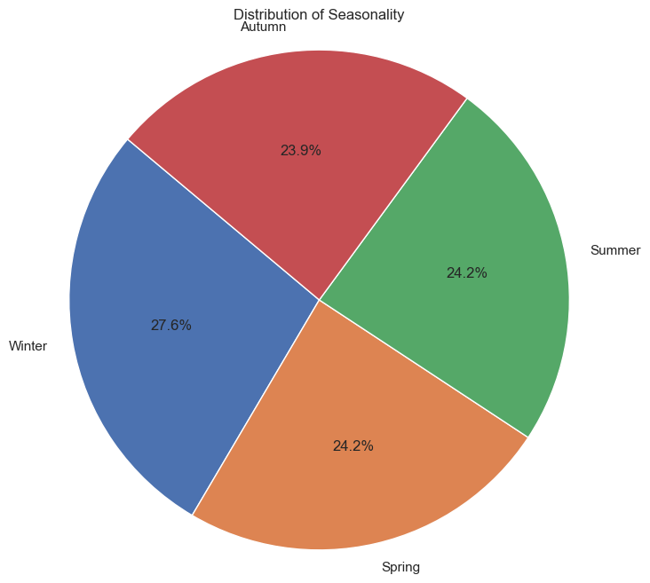
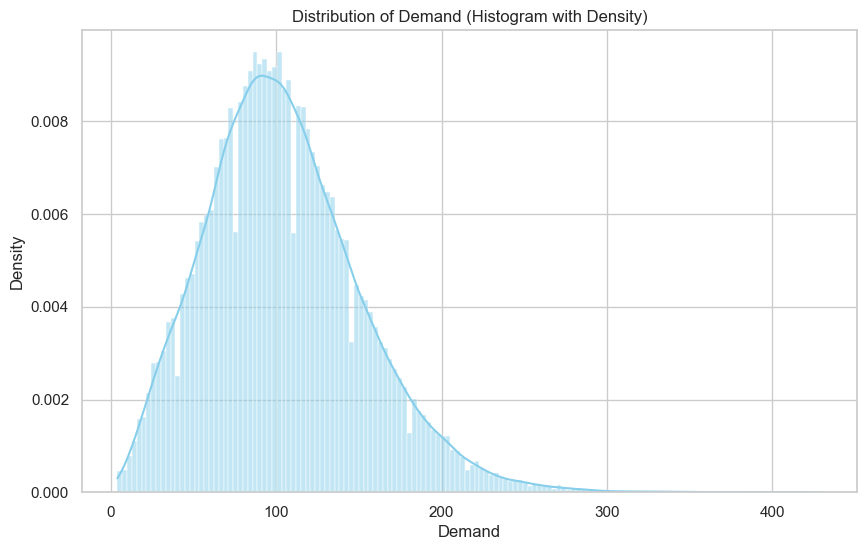
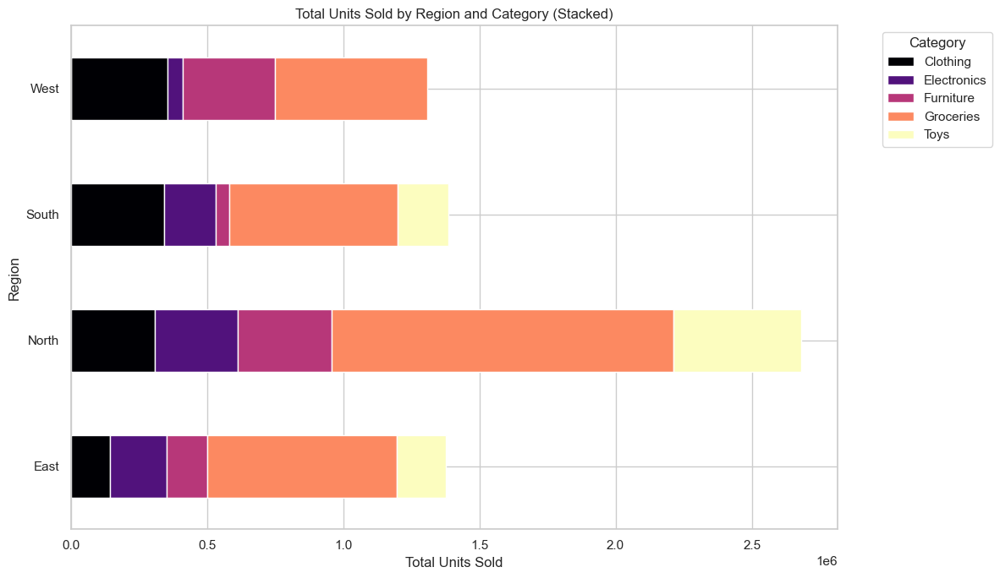
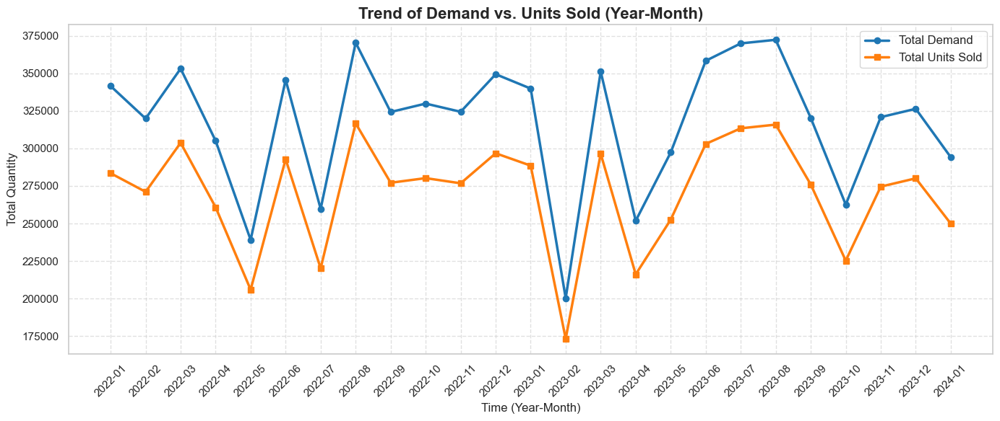
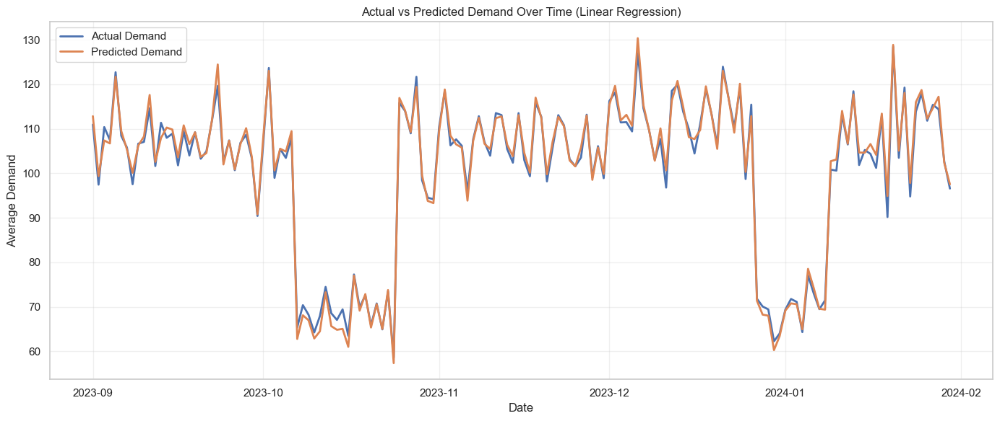
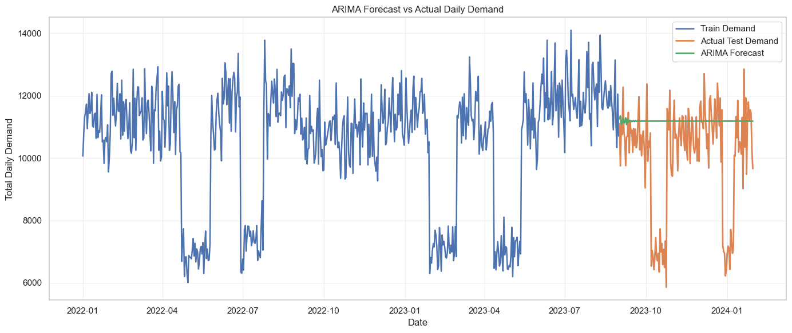
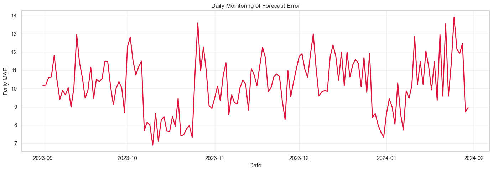

# 📦 Demand Forecasting with PySpark & Distributed Storage

> A full end-to-end distributed data analysis pipeline for e-commerce demand forecasting — from raw ingestion to model deployment — built with **PySpark**, **MinIO**, and **Streamlit**.

---

## 📌 Table of Contents

- [Project Overview](#-project-overview)
- [Team Roles](#-team-roles)
- [Architecture](#-architecture)
- [Dataset](#-dataset)
- [Project Structure](#-project-structure)
- [Setup & Installation](#-setup--installation)
- [Running the Project](#-running-the-project)
- [Exploratory Data Analysis](#-exploratory-data-analysis)
- [Model Training & Evaluation](#-model-training--evaluation)
- [Deployment — Streamlit App](#-deployment--streamlit-app)
- [Big Data Optimizations](#-big-data-optimizations)

---

## 🔍 Project Overview

This project aims to **predict e-commerce product demand** using distributed computing with PySpark to improve supply chain efficiency, reduce stockouts, and optimize inventory management.

The pipeline covers the complete data lifecycle:

| Stage | Description |
|---|---|
| **Ingestion** | Read & clean raw CSV data with PySpark |
| **Storage** | Distributed storage via MinIO (S3-compatible data lake) |
| **EDA** | Exploratory analysis with visualizations |
| **Modeling** | Linear Regression, Random Forest, Gradient Boosting, ARIMA |
| **Optimization** | Spark repartitioning, caching, and parallel processing |
| **Deployment** | Streamlit web app for real-time demand prediction |

---

## 👥 Team Roles

| Role | Responsibilities |
|---|---|
| **Data Engineer** | Data ingestion, cleaning & preprocessing with PySpark, distributed storage (MinIO) |
| **Data Analyst** | EDA, trend analysis, visualizations, and business insights |
| **ML Engineer** | Feature engineering (lag features, seasonality), model training & evaluation |
| **Big Data Engineer** | Spark job optimization, repartitioning, replication, fault tolerance |
| **MLOps Engineer** | Model deployment to MinIO, Streamlit app, batch inference, monitoring |

---

## 🏗️ Architecture

```
Raw CSV Data
     │
     ▼
┌─────────────────────┐
│   PySpark Session   │  ← local[*] or cluster
│   (Cleaning & EDA)  │
└────────┬────────────┘
         │
         ▼
┌─────────────────────┐       ┌──────────────────────┐
│  MinIO Data Lake    │◄─────►│  Docker Compose       │
│  (S3-compatible)    │       │  (minio service)      │
│  Buckets:           │       └──────────────────────┘
│  • demand-lake      │
│  • cleaned-data     │
│  • backup-data      │
└────────┬────────────┘
         │
         ▼
┌─────────────────────┐
│   ML Pipeline       │
│ • Preprocessing     │
│ • Linear Regression │  ← Best model (R² = 0.906)
│ • Random Forest     │
│ • Gradient Boosting │
│ • ARIMA             │
└────────┬────────────┘
         │
         ▼
┌─────────────────────┐
│   Streamlit App     │  ← Real-time demand prediction
│   (app/app.py)      │
└─────────────────────┘
```

---

## 📊 Dataset

**File:** `data/demand_forecasting.csv`  
**Size:** ~76,000 rows | 18 columns  
**Source:** Historical e-commerce sales data (2022–2024)

| Feature | Type | Description |
|---|---|---|
| `Date` | Date | Transaction date |
| `Store ID` | String | Store identifier |
| `Product ID` | String | Product identifier |
| `Category` | Categorical | Groceries, Clothing, Electronics, Toys, Furniture |
| `Region` | Categorical | North, South, East, West |
| `Inventory Level` | Float | Current stock on hand |
| `Units Sold` | Float | Units sold on this date |
| `Units Ordered` | Float | Units ordered for restocking |
| `Demand` | Float | **Target variable** — actual demand |
| `Price` | Float | Product price |
| `Discount` | Float | Discount applied (0–1) |
| `Promotion` | Boolean | Whether a promotion was active |
| `Weather Condition` | Categorical | Sunny, Rainy, Snowy, Cloudy |
| `Seasonality` | Categorical | Winter, Spring, Summer, Autumn |
| `Competitor Pricing` | Float | Competing product price |
| `Epidemic` | Boolean | Whether an epidemic was active |

---

## 📁 Project Structure

```
demand-forecasting-pyspark/
│
├── README.md                        ← You are here
├── requirements.txt                 ← Python dependencies
├── docker-compose.yml               ← MinIO service
├── .gitignore                       ← Ignored files
│
├── notebooks/
│   └── Distributed_Analysis_Project.ipynb   ← Full pipeline notebook
│
├── app/
│   └── app.py                       ← Streamlit prediction app
│
├── data/
│   └── demand_forecasting.csv       ← Raw dataset
│
├── local_models/
│   ├── preprocessing_pipeline/      ← Saved Spark preprocessing pipeline
│   └── linear_regression/           ← Saved best model (Linear Regression)
│
└── docs/
    ├── images/                      ← Output visualizations
    ├── dist final project.pdf       ← Project requirements
    └── Distributed Documentation.docx.pdf
```

---

## ⚙️ Setup & Installation

### Prerequisites

- Python 3.10+
- Java 8 or 11 (required for PySpark)
- Docker Desktop (for MinIO)

### 1. Clone the repository

```bash
git clone https://github.com/<your-username>/demand-forecasting-pyspark.git
cd demand-forecasting-pyspark
```

### 2. Create a virtual environment & install dependencies

```bash
python -m venv venv
# Windows
venv\Scripts\activate
# macOS/Linux
source venv/bin/activate

pip install -r requirements.txt
```

### 3. Start MinIO (optional — for distributed storage mode)

```bash
docker compose up -d
```

MinIO console will be available at: **http://localhost:9001**  
Default credentials: `minioadmin / minioadmin`

Create the following buckets in the MinIO console:
- `demand-lake`
- `cleaned-data`
- `backup-data`

---

## 🚀 Running the Project

### Option A — Run the Full Pipeline (Notebook)

Open and run all cells in order:

```bash
jupyter notebook notebooks/Distributed_Analysis_Project.ipynb
```

The notebook covers:
1. Data ingestion & cleaning
2. EDA & visualizations
3. Feature engineering
4. Model training & evaluation
5. Saving models to MinIO / local

### Option B — Run the Streamlit Prediction App

**Using local models (no Docker needed):**

```bash
streamlit run app/app.py
```

In the sidebar, select **"Local filesystem"** as the model source. The app will load models from `local_models/`.

**Using MinIO (distributed mode):**

Start Docker first, then:

```bash
streamlit run app/app.py
```

Select **"MinIO (s3a://)"** in the sidebar and ensure models have been saved to MinIO by running the notebook first.

---

## 📈 Exploratory Data Analysis

### Average Demand by Product Category

Groceries and Clothing show the highest average demand across all regions.



---

### Correlation Heatmap

`Units Sold` (0.83) is the strongest predictor of `Demand`. `Epidemic` shows a notable negative correlation (−0.36).



---

### Seasonality Distribution

Demand is fairly balanced across seasons, with Winter showing a slight lead at 27.6%.



---

### Demand Distribution

Right-skewed distribution — most products have demand between 50–150 units per day, with occasional spikes.



---

### Regional Sales by Category

The **North** region has the highest total sales volume across all categories. Groceries dominate every region.



---

### Demand vs. Units Sold Trend (2022–2024)

Total demand consistently tracks above total units sold, indicating recurring inventory gaps.



---

## 🤖 Model Training & Evaluation

### Feature Engineering

Engineered features added to improve model performance:

| Feature | Description |
|---|---|
| `lag_1_demand` | Demand from 1 day ago |
| `lag_7_demand` | Demand from 7 days ago |
| `rolling_7_avg_demand` | 7-day rolling average demand |
| `inventory_gap` | Inventory Level − Expected Demand |
| `price_gap` | Price − Competitor Pricing |
| `sell_through_ratio` | Units Sold / Inventory Level |
| `order_fill_ratio` | Units Sold / Units Ordered |
| `Year`, `Month`, `DayOfWeek` | Temporal features extracted from Date |

### Model Comparison

| Model | RMSE | MAE | R² |
|---|---|---|---|
| **Linear Regression** ✅ | **13.52** | **10.19** | **0.906** |
| Gradient Boosting | 16.01 | 12.61 | 0.868 |
| Random Forest | 17.07 | 13.37 | 0.850 |

> **Best Model: Linear Regression** — selected based on lowest RMSE and highest R² (0.906).

### Actual vs. Predicted Demand (Linear Regression)

The model closely tracks actual demand patterns over time with minimal deviation.



---

### ARIMA Baseline (Time Series)

An ARIMA(7,1,2) model was trained as a classical time-series baseline using only historical demand.

| Model | RMSE | MAE | R² |
|---|---|---|---|
| ARIMA(7,1,2) | 2084.16 | 1415.41 | −0.44 |

ARIMA performs significantly worse than the ML models, confirming that **external features (promotions, weather, pricing) are critical** for accurate demand forecasting.



---

## 🖥️ Deployment — Streamlit App

The Streamlit app (`app/app.py`) provides a real-time demand prediction interface.

**Features:**
- Select model source: **Local filesystem** or **MinIO (s3a://)**
- Choose model type: Linear Regression, Random Forest, or Gradient Boosting
- Input all product features interactively
- Click **"Predict Demand"** to get the forecasted demand

---

### MLOps Monitoring

Daily forecast error (MAE) is tracked over time to detect model drift and degradation.



---

## ⚡ Big Data Optimizations

| Technique | Details |
|---|---|
| **Repartitioning** | `repartition(8, "Region", "Category")` groups related records for efficient joins |
| **Caching** | Frequently accessed DataFrames are cached in memory |
| **Columnar Storage** | Data saved as Parquet for fast column-pruning reads |
| **Vectorized Reads** | Disabled S3A vectored reads to avoid Windows compatibility issues |
| **Replication** | MinIO bucket replication configured for fault tolerance |
| **Partitioned writes** | Output partitioned by `Region` and `Category` for faster downstream queries |

---

## 🛠️ Tech Stack


| Library | Purpose |
|---|---|
| `pyspark` | Distributed data processing & ML |
| `streamlit` | Interactive web app |
| `boto3` | MinIO / S3 client |
| `statsmodels` | ARIMA time series model |
| `pandas`, `matplotlib`, `seaborn` | Data analysis & visualization |
| `docker-compose` | MinIO service orchestration |
